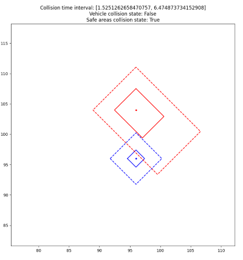
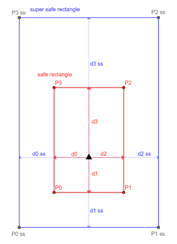
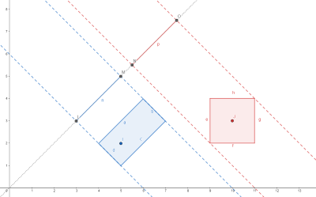

# **Collision detection and Avoidance tools**

## __Info__
ca_utils is a python library meant for collision prediction, detection and (maybe) avoidance between both static and moving convex polygons

The library is meant to be used with GPS Position data from moving objects.

---

## Coordinates translation
GPS coordinates received as Lat, Lon in WGS84 are translated into local cartesian coordinates according to the specified origin point 
### Measurement Units
- Lat, Lon: degrees * 10^-7
- Heading: degrees, CW Positive from north (-180°N % 180°N)

## Safety polygons
Methods update_safety_rectangle and update_super_safe_rectangle of class moving_object are definig a rectangle oriented according to vehicle heading.  

- Safe Polygon  
Polygon representing the area occupied by the vehicle/object. Used for collision time computation
- Super Safe Polygon  
Used for collision detection only, representative of the safe area around the vehicle/object that shouldn't be crossed
## Static SAT
Implementation of the separating axis theorem for 2D convex polygons  
More at https://en.wikipedia.org/wiki/Hyperplane_separation_theorem

## Moving SAT
Separating axis theorem implementation based on the moving intervals time occupation of projection over axis. 
The result is the interval __start of collision - end of collision__
### Possible results:
- [-inf, inf]: Objects are indefinetly colliding (same speed, same direction, crossing safe polygons)
- [t0 > 0, t1 > 0]: Objects in collision course, collision starting in t0 seconds and ending in t1 seconds
- [nan, nan]: Objects not in collision course
- [t0 < 0, t1 > 0]: Objects already colliding, end of collision in t1 seconds
- [t0 < 0, t1 < 0]: Collision not happening / already happened

## Object Types Definition
Objects name, safe & super-safe polygon relative coordinates and mission pause priority are defined in ca_utils.py.  
Setting will be moved to obj_types.json
## Plotting
Plot functions working with matplotlib pyplot for real time visualization of fleet, safe areas and collision state.  
Plot objects must be pre-defined before passing them as argument. 
If the plot function is used, the time wait should be implemented via plt.pause()